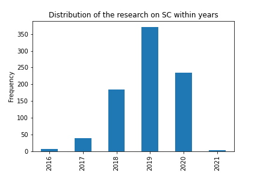

[](http://quantlet.de/)

## [](http://quantlet.de/) **SC_literature_research** [](http://quantlet.de/)

```yaml

Name of Quantlet: 'SC_literature_research'

Published in: 'Hype or Hope? Understanding Smart Contracts.'

Description: 'This Quantlet is dedicated to topic modeling on the existing research on Ethereum Smart Contracts.
First, we encode our abstracts with Distilbert embeddings and using UMAP we reduce dimensionality reduction to perform K-Means, finally again using UMAP
reduce dimensionality to 2, to be able to plot it.'

Quantlet Scripts Description:
- SC_literature_research.ipynb the code to create basic understanding of the Literature Research using its keywords
- BERT_Embeddings.ipynb clustering of the exsting research, using Distilbert embeddings, UMAP dimensionality reduction and K-Means clustering

Keywords: 'Scopus, literature research, DistilBERT, topic modelling, clustering, UMAP, K-Means'

Author: 'Elizaveta Zinovyeva, Raphael Constantin Georg Reule'

Submitted:  'Jan 12 2021 by Elizaveta Zinovyeva'

Datafile:
- scopus.csv the file created using Scopus database, containing titles of existing research papers with abstracts and keywords. Please consult the paper's appendix to get the exact Scopus query
- other datasets are created within this Quantlet, so please just use the codes in the order listed in Quantlet Scripts Description

Additional Notes:
- you would need to create additional folder images
- be aware of the redundancies in the code. The code presented here is not made for production (neither it is optimized for production). It's purpose is solely to see and to be able to compare all the numbers presented in the paper

```




### [IPYNB Code: SC_literature_research.ipynb](SC_literature_research.ipynb)


automatically created on 2021-01-21